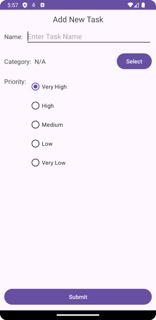

# TaskManager Android App

## Introduction
The Task Manager App is an Android application developed to help users organize and manage their tasks efficiently. This README provides an overview of the app's features, components, setup instructions, and usage guidelines.

## Features
- Add tasks with name, category, and priority.
- View list of tasks with name, category, and priority.
- Sort tasks by priority (ascending or descending).
- Delete tasks.
- Navigate between fragments to perform various actions.

## Components
The app consists of the following main components:

### MainActivity
- Central activity managing fragment transactions and task data.
- Responsible for loading the initial fragment and handling communication between fragments.

### TasksFragment
- Displays the list of tasks.
- Communicates with MainActivity to receive and update task data.
- Allows sorting tasks by priority and navigating to other fragments.

### AddTaskFragment
- Provides a form to add a new task with name, category, and priority.
- Communicates with MainActivity to add the new task to the task list.

### SelectCategoryFragment
- Allows users to select a category for a new task.
- Communicates with AddTaskFragment to pass the selected category.

### TaskDetailFragment
- Displays detailed information about a selected task, including name, category, and priority.
- Communicates with MainActivity to delete the selected task.

## Screenshots

              

        

## Setup Instructions
1. Clone the repository to your local machine.
2. Open the project in Android Studio.
3. Build and run the project on an Android device or emulator.

## Usage
1. Launch the app on your Android device.
2. The TasksFragment will be displayed, showing the list of tasks.
3. Use the options in the TasksFragment to add, delete, or sort tasks.
4. Navigate between fragments as needed to perform different actions.
5. Follow on-screen instructions and use buttons to interact with the app.

## Author

Jaya Sravani Sirigineedi

## Acknowledgments

- This app was created as part of Mobile Application Development course at UNCC.
